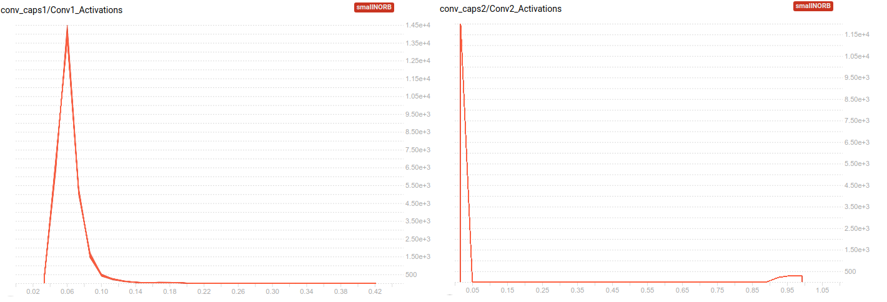
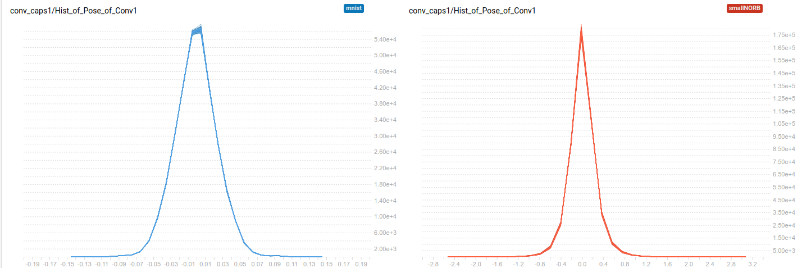

# EM Capsnet Performance Analysis
## Experiment 
Capsule network is a new proposed neural network in
[GEH18](https://openreview.net/pdf?id=HJWLfGWRb) as an enhancement to Convlutional
Neural Network(CNN) and potentially could replace CNNs in different application that require
more accurate detection of objects that tends to change in terms of graphical properties such
as position, orientation and thickness. In this work, we study the architecture of a capsule
network, demonstrate its bottlenecks by profiling its operation and finally we propose potential
solutions that can take advantage of patterns we have observed that can be implemented as a
hardware accelerator. 
### Based on the implementation of [Matrix-Capsules](https://github.com/www0wwwjs1/Matrix-Capsules-EM-Tensorflow)

## Graphs
This figure shows tests accuracy of three benchmarks evaluated which are MNIST, Fashion-MNIST and SmallNORB.


This figure shows activations histogram through the caps layer which shows that activations in capslayer follow the same pattern as CNN layers activation, it gets more sparse when going deeper to the network.  


This figure shows the pose matrix (which learns the graphical features of an object) histogram of the learned pose matrix across MNIST and SmallNORB. As observed, pose matrix of smallNORB tends to be more wide compared to MNIST since the dataset represents oriented objects which exploits the problem that CNN struggles to learn.    

### Read final report in [here](./EECE527_Final_Report.pdf)

## Profiling Ops
This table shows the most expensive operations in terms of memory usage and execution time
| OP Name      |Alloc. Bytes|Exec. time  |
| ------------- |:-------------:| -----:|
| BatchMatMul   | 297.25MB | 263.69ms |
|Mul |  513.12MB   |3.32ms |
|Sum|21.48MB    |3.32ms |
|Sub |163.70MB |2.73ms    |
|Conv2D|14.56MB   |1.48ms |
|Tile   |326.25MB    |1.04ms|

## Reproduce
**Step 1.**
Clone this repository with ``git``.
```
$ git clone https://github.com/maomran/CapsNet.git
$ cd CapsNet
```
**Step 2.**
Download the [MNIST dataset](http://yann.lecun.com/exdb/mnist/)
```
$ mkdir -p data/mnist
$ wget -c -P data/mnist http://yann.lecun.com/exdb/mnist/{train-images-idx3-ubyte.gz,train-labels-idx1-ubyte.gz,t10k-images-idx3-ubyte.gz,t10k-labels-idx1-ubyte.gz}
$ gunzip data/mnist/*.gz
```
***To install smallNORB, follow instructions in ```./data/README.md```***

**Step 3.**
Start the training(MNIST):
```
$ python3 train.py "mnist"
```
Start the training(smallNORB):
```
$ python3 train.py "smallNORB"
```
Start the training(CNN baseline):
```
$ python3 train_baseline.py "smallNORB"
```

**Step 3.**
Start the test on MNIST:
```
$ python3 test.py "mnist" "caps"
```

Start the test on smallNORB:
```
$ python3 test.py "smallNORB" "caps"
```
**Step 3.**
Results are generated in folder ```results```

**Step 4.**
View your profiling on tensorboard. 


